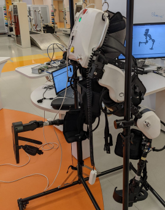
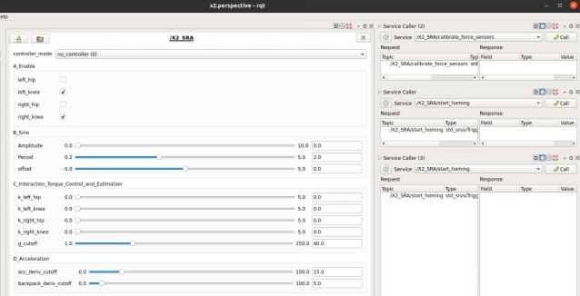
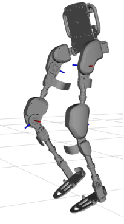
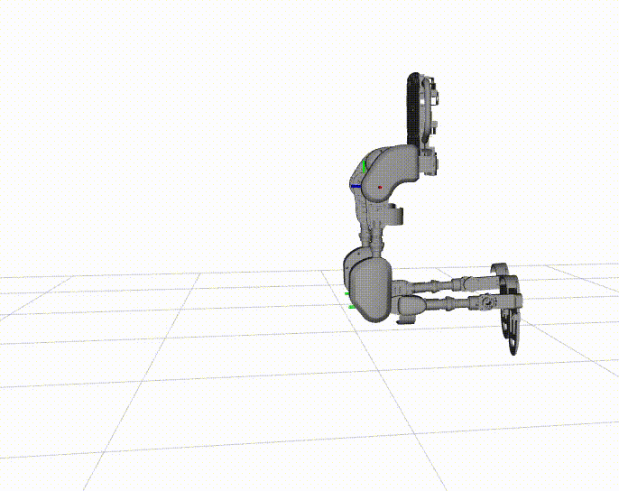

# Advanced Simulation and Hardware Testing using ROS and X2 Exoskeleton

The following instructions detail the building and testing of a ROS application to simulate the X2 exoskeleton in Gazebo
 while allowing to use the same code on the actual X2 robot.

## Program Overview

This example illustrates a program that is capable of:

* Simulating the X2 exoskeleton in Gazebo
* Real-time visualization of the actual X2 exoskeleton on RViz
* Running the same code both on simulation and real hardware
* Changing controllers and their parameters in real-time with a provided UI.
* Sending homing and calibration like commands through ROS services, and through gui.



## Setup Instructions

It is assumed that an Ubuntu PC is used and ROS is installed. If this is not the case for you, please visit [here](InstallLinux.md) and [here](InstallROS.md).

### Additional Dependencies

The following packages are also required for this program. If you do not have access to them, email `baris.kucuktabak@u.northwestern.edu`

* [x2_description](https://github.com/emekBaris/x2_description)
* [cob_gazebo_plugins](https://github.com/emekBaris/cob_gazebo_plugins)

### Build

Create a catkin workspace if you don't have one yet:
```bash
$ mkdir -p ~/catkin_ws/src
$ cd ~/catkin_ws/
$ catkin build
```

Clone CORC and the required packages into your workspace:
```bash
$ cd ~/catkin_ws/src
$ git clone https://github.com/UniMelbHumanRoboticsLab/CANOpenRobotController.git
$ git clone https://github.com/emekBaris/x2_description.git
$ git clone https://github.com/emekBaris/cob_gazebo_plugins.git
```

Make sure `USE_ROS` flag is set to `ON` in CMakeLists.txt:
```set(USE_ROS ON)```

If you will test on the real robot:
```set(NO_ROBOT OFF)```

If you would like to do a simulation: 
```set(NO_ROBOT ON)```

Set your state machine (X2DemoMachine):
```set (STATE_MACHINE_NAME "X2DemoMachine")```

Build CORC:
```bash
$ cd ~/catkin_ws
$ catkin build CORC
$ source devel/setup.bash
```

## Executing the X2DemoMachine

The following testing steps are advised to follow initially:

### Testing the simulation
Run
```bash
$ roslaunch CORC x2_sim.launch
```

rqt gui and rviz with X2 should be opened without any errors.

 

Switch between zero torque and zero velocity controllers using the gui. You should see the following message on your terminal without any errors.
```
[CORC] [info] Switched to torque controller
[CORC] [info] Switched to velocity controller
```

Now, switch to controller 4 that allows sending sinusoidal velocity commands to each joint. 
Enable the joints you would like to move and adjust the amplitude and perioud via sliders on the gui.



Try the same thing with sending torque commands with controller 5.

**IMPORTANT NOTE:** Simulation assumes that exoskeleton is flying (i.e., there is no ground reaction force). 
Moreover, the backpack is fixed to vertical 90°.

**IMPORTANT NOTE 2:** Reflected rotor inertia is not incorporated into the simulation. 
Due to the high reflected rotor inertia, this results in a very inaccurate simulation of torque control.

$\tau_{reflected-rotor} = RR^2*I_{rotor}$ where $RR$ is the reduction ratio.

### Testing on the real robot

If you do not have an imu at the backpack comment out the last 5 lines of ```config/x2_params.yaml``` that are related to imu.

```bash
$ roslaunch CORC x2_real.launch
```

Choose the zero torque controller and move the joints by hand. Rviz reprensentation of X2 should change simultaneously.

Choose the zero velocity controller and try to move the joints. Joints should be fixed at their current position.

Test controller 4 and controller 5 carefully by slowly increasing the amplitude of the command through gui. 
Note that you should be pressing the green button for those controllers to work (see ```X2DemoState.cpp``` for the implementation details). 
If anything dangerous happens, releasing the green button should send zero torque commands to all joints.

#### Homing
By using the service caller on the right side of the gui you can command the homing procedure. 
This should be done when there is no user in the exoskeleton.

There is no need to do homing again even if you restart the program (unless you do not turn off the robot).

**IMPORTANT** do not test controller 3 if you have not implemented strain gauges or not have an imu at the backpack.

## Customizing the Demo State and GUI

Developers and users are encouraged to follow [here](../3.Software/CustomApplication), read through and modify the  ```X2DemoState``` class and ```config/x2_dynamic_params.cfg``` accordingly based on their needs. 


