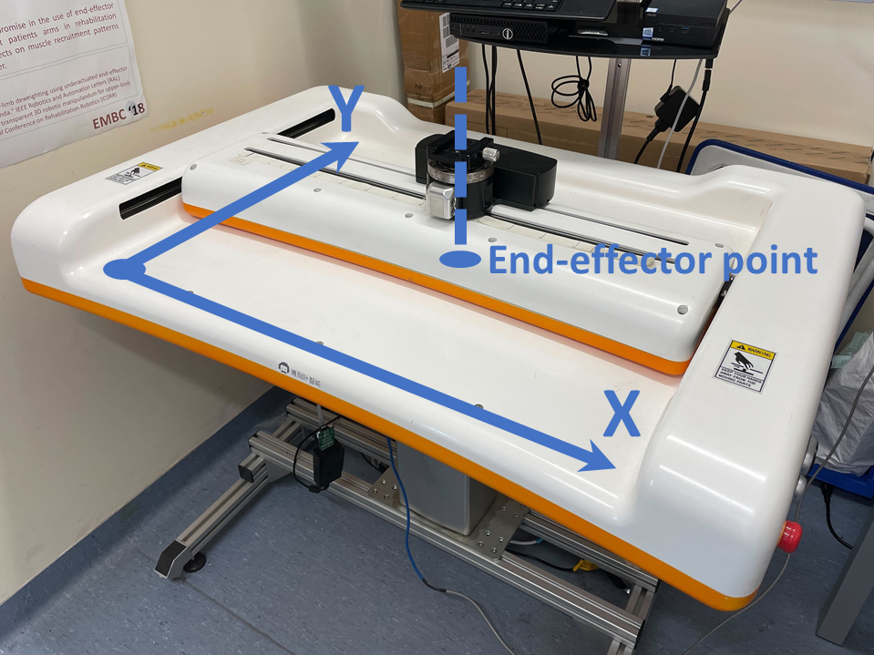

# Hardware Testing - ArmMotus M2 Planar Manipulandum

This page introduces the M2DemoMachine, an example CORC app showing the basic use of the M2 planar manipulandum.

The M2 is a 2 DoFs impedance based robot developed by Fourier Intelligence:


ArmMotus M2 and reference coordinates.

The state machine code can be found in the folder `src/apps/M2DemoMachine`.

It demonstrates the use of:
- The different control modes of M2 (position, velocity, or torque)
- The use of the libFLNL comunication library to pusblish the robot state in a Unity software and send commands to the state machine


## Running the state machine

In the CMakeLists.txt select the M2DemoMachine and set the flags for using a real robot without ROS support:

```cmake
#set (STATE_MACHINE_NAME "ExoTestMachine")
#set (STATE_MACHINE_NAME "M1DemoMachine")
set (STATE_MACHINE_NAME "M2DemoMachine")
#set (STATE_MACHINE_NAME "M3DemoMachine")
#set (STATE_MACHINE_NAME "X2DemoMachine")
#set (STATE_MACHINE_NAME "LoggingDevice")
# Comment to use actual hardware, uncomment for a nor robot (virtual) app
set(NO_ROBOT OFF)
# ROS Flag. set ON if you want to use ROS. Else, set OFF.
set(USE_ROS OFF)
```

If you intend to cross-compile for a BeagleBone (Black or AI), run: `$ rm -r build && mkdir build && cd build && cmake -DCMAKE_TOOLCHAIN_FILE=../armhf.cmake ..`

otherwise, to run the state machine locally use: `$ rm -r build && mkdir build && cd build && cmake .. `

Then simply compile the state machine: `$ make -j2`

This should create the application `M2DemoMachine` within the build folder. After initialising the CANbus (using the `initCAN0.sh` or `initCAN1.sh` script) you should be able to run the application, either locally or on the BB (through SSH).

**WARNING:** With an M2 connected on the CAN bus the robot will imediatly start to move after running the application (to go in a calibration pose), ensure the space is clear around the robot.

Once the calibration state is finished, you can circle through the different demo states using the keyboard (key 1) or using the joystick first button.


## RobotM2 Control methods

The CORC M2 robot model has the following specific methods of interaction:
- Obtaining current **joint state** (as for any CORC robot): `robot->getPosition()`, `robot->getVelocity()`, `robot->getTorque()`.
- **Joint level interaction**: `setJointPosition(VM2 q)`, `setJointVelocity(VM2 dq)` and `setJointTorque(VM2 tau)` allow to apply a position, velocity or torque control using an Eigen::vector of length 2. An example of the torque control can be found in the `M2CalibState` state. Note the use of `robot->initTorqueControl();` in the `entryCode()` method before applying torque control.
- Obtaining current **end-effector state**: `robot->getEndEffPosition()`, `robot->getEndEffVelocity()`, `robot->getEndEffForce()`. Methods are also provided to obtain the filtered velocity and acceleration (obtained through differentiation and low-pass filtering). Additionnaly the pure interaction force at the end-effector, measured by a pair of force sensors can be obtained using the `robot->getInteractionForce()` method.
- **End-effector space control** is available using: `setEndEffPosition(VM2 X)`, `setEndEffVelocity(VM2 dX)`, `setEndEffForce(VM2 F)`. These methods rely on the `inverseKinematic()` and robot Jacobian `J()` and assumes that the kinematic parameters are correct and that the robot has been calibrated (see `applyCalibration()`). As for their joints counterparts they require the proper use of the corresponding initTorque/Velocity/Position method beforehand. The command vectors are expressed in the robot base frame as shown on the picture above. An example of the use of the end-effector velocity control is available in the `M2EndEffDemo` state.
- Finally, the method `setEndEffForceWithCompensation(VM2 F, bool friction_comp=true)` can be used to apply an end-effector force in addition to the **friction compensation**. This method relies on the robot model and parameters (friction coefficients).

See the Doxygen page of the `RobotM2` class for a full list of available methods.


## Network communication with libFLNL

The M2DemoMachine app is using libFLNL to publish the robot states and read incoming commands over a TCP/IP connection. Together with the use of an FLNLHelper object (`UIserver = new FLNLHelper(robot, "192.168.6.2");`), the library allows to send the robot state at every control loop (`UIserver->sendState();` within the `M2DemoMachine::hwStateUpdate(void)` method) and send and process incoming commands. CORC app is here acting as a server on the specified IP (and port, optional, default is 2048) to which client application can connect to.


An exemple class to process incoming states and send/receive commands from a Unity or Matlab script (client side) can be found [here](https://github.com/UniMelbHumanRoboticsLab/CORC-UI-Demo). 
